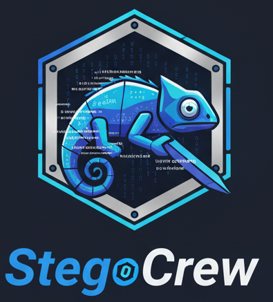

<div align="center">
  

  # StegoCrew

  ### Multi-Agent CTF Steganography Solver

  > **Learn CrewAI by building a real-world CTF challenge solver**

  [](https://github.com/Hanimn/StegoCrew)
  [](https://python.org)
  [](https://crewai.com)
  [](LICENSE)
</div>

---

A comprehensive, beginner-friendly tutorial project that teaches you how to build multi-agent AI systems using CrewAI by creating an automated steganography challenge solver for CTF competitions.

---

## 🎓 What You'll Build

A **5-agent AI system** that automatically analyzes and solves steganography challenges:

```
Suspicious File → [AI Agent Team] → Solution + Flag
```

**The Team:**
- 🔍 **Reconnaissance Agent** - Analyzes file structure and metadata
- 🛠️ **Steganography Expert** - Extracts hidden data using specialized tools
- 🧩 **Pattern Hunter** - Detects encodings and patterns
- 🔐 **Decoder Agent** - Decrypts and decodes data
- 📊 **Orchestrator** - Coordinates the team and compiles results

---

## 🎯 Learning Objectives

This project will teach you:

✅ **Multi-Agent Systems** - How AI agents work together as a team
✅ **CrewAI Framework** - Creating agents, tools, tasks, and crews
✅ **Tool Integration** - Wrapping system tools for agent use
✅ **Workflow Design** - Sequential task processing and context sharing
✅ **Real-world AI** - Building practical applications with LLMs
✅ **CTF Techniques** - Steganography detection and solving methods

---

## 🚀 Quick Start

### **Step 1: Read the Learning Guide**

Start here: **[LEARNING_GUIDE.md](./LEARNING_GUIDE.md)**

This is your roadmap through the entire course.

### **Step 2: Begin Lesson 1**

Jump into: **[Lesson 1: Understanding Multi-Agent Systems](./docs/lessons/LESSON_01.md)**

Learn the core concepts before writing code.

### **Step 3: Reference the Glossary**

Bookmark: **[GLOSSARY.md](./docs/GLOSSARY.md)**

All technical terms explained in simple language.

---

## 📚 Course Structure

| Lesson | Topic | Duration | Status |
|--------|-------|----------|--------|
| **[Lesson 1](./docs/lessons/LESSON_01.md)** | Understanding Multi-Agent Systems | 1-2 hours | ✅ Ready |
| **[Lesson 2](./docs/lessons/LESSON_02.md)** | Environment Setup | 1-2 hours | ✅ Ready |
| **[Lesson 3](./docs/lessons/LESSON_03.md)** | Your First Agent (Hello World) | 2-3 hours | ✅ Ready |
| **[Lesson 4](./docs/lessons/LESSON_04.md)** | Custom Tools Deep Dive | 2-3 hours | ✅ Ready |
| **[Lesson 5](./docs/lessons/LESSON_05.md)** | Multi-Agent Coordination | 3-4 hours | ✅ Ready |
| **[Lesson 6](./docs/lessons/LESSON_06.md)** | Real Steganography Tools | 3-4 hours | ✅ Ready |
| **[Lesson 7](./docs/lessons/LESSON_07.md)** | Building the Complete MVP | 4-6 hours | ✅ Ready |
| **[Lesson 8](./docs/lessons/LESSON_08.md)** | Testing, Debugging & Deployment | 2-3 hours | ✅ Ready |

**Total Time:** 2-3 weeks part-time, 1 week full-time

---

## 📋 Prerequisites

### **You Should Know:**
- ✅ Basic Python (functions, classes, imports)
- ✅ Command line basics (cd, ls, running commands)
- ✅ Basic understanding of files and APIs

### **You Don't Need:**
- ❌ Machine learning experience
- ❌ Advanced Python skills
- ❌ Prior knowledge of CrewAI or LangChain
- ❌ Steganography expertise

**If you know Python basics, you're ready to start!**

---

## 🛠️ Technology Stack

### **Core Framework**
- Python 3.10+
- CrewAI framework
- LangChain tools

### **AI Models**
- Anthropic Claude (recommended)
- OpenAI GPT-4 (alternative)
- Local models via Ollama (optional)

### **Steganography Tools**
- steghide, binwalk, exiftool
- zsteg, foremost, strings
- And more...

---

## 📖 Documentation Structure

```
StegoCrew/
├── README.md                    ← You are here
├── LEARNING_GUIDE.md           ← Start here!
├── Claude.md                    ← Original project plan
│
├── docs/
│   ├── GLOSSARY.md             ← All terms explained
│   ├── lessons/
│   │   ├── LESSON_01.md        ← Multi-agent concepts
│   │   ├── LESSON_02.md        ← Environment setup
│   │   └── ...                 ← More lessons
│   └── reference/
│       └── ...                 ← Technical references
│
├── examples/
│   └── ...                     ← Code examples
│
└── src/                        ← We'll build this together!
    ├── agents/
    ├── tools/
    ├── tasks/
    └── main.py
```

---

## 🎯 Project Goals

### **Educational Goals**
1. Master CrewAI fundamentals through hands-on practice
2. Understand how multi-agent systems work
3. Learn to integrate AI with existing tools
4. Build a complete, working project you can showcase

### **Technical Goals**
1. Create a CTF solver with 80%+ success rate on common challenges
2. Build modular, maintainable code
3. Implement proper error handling and logging
4. Generate comprehensive solution reports

---

## 🧭 Learning Path

### **Phase 1: Foundations (Week 1)**
- Understand multi-agent concepts
- Set up development environment
- Build your first simple agent
- Create custom tools

**Outcome:** Working agent that can use basic tools

### **Phase 2: Integration (Week 2)**
- Build multi-agent crews
- Integrate steganography tools
- Implement agent communication
- Handle file analysis

**Outcome:** Multiple agents working together

### **Phase 3: Production (Week 3)**
- Complete MVP implementation
- Comprehensive testing
- Debugging and optimization
- Documentation and polish

**Outcome:** Production-ready CTF solver

---

## 💡 Teaching Philosophy

This course follows these principles:

1. **Learn by Building** - Hands-on coding from day one
2. **Explain the Why** - Understand concepts, not just syntax
3. **Iterate and Improve** - Start simple, add complexity gradually
4. **Real-world Application** - Build something actually useful
5. **Support Learning** - Clear docs, examples, and troubleshooting

---

## 🆘 Getting Help

### **Documentation**
- [LEARNING_GUIDE.md](./LEARNING_GUIDE.md) - Main course guide
- [GLOSSARY.md](./docs/GLOSSARY.md) - Term definitions
- Lesson files - Step-by-step instructions

### **Stuck on Something?**
1. Check the glossary for term definitions
2. Review previous lesson materials
3. Look at code examples
4. Ask your mentor (that's me!)

---

## 🎓 What You'll Gain

By completing this project, you'll have:

1. **Portfolio Project** - A complete, working multi-agent system
2. **Practical Skills** - Real-world AI development experience
3. **Deep Understanding** - Not just copying code, but understanding how it works
4. **CTF Knowledge** - Steganography techniques and tools
5. **Framework Mastery** - CrewAI proficiency you can apply to other projects

---

## 🌟 Beyond This Course

After completing this project, you can:

- Build other multi-agent systems (research assistants, content creators, etc.)
- Contribute to the CrewAI community
- Extend this project with new features
- Apply these concepts to your own projects
- Help others learn!

---

## 📜 License & Usage

This project is for **educational purposes**. Use responsibly:
- ✅ Learning and practicing CTF skills
- ✅ Authorized CTF competitions
- ✅ Educational demonstrations
- ❌ Unauthorized access to systems
- ❌ Malicious purposes

---

## 🙏 Acknowledgments

- **CrewAI Team** - For the amazing framework
- **CTF Community** - For knowledge sharing
- **You** - For embarking on this learning journey!

---

## 🚀 Ready to Begin?

**Start your journey here:** [LEARNING_GUIDE.md](./LEARNING_GUIDE.md)

**Questions?** Feel free to ask your mentor (me!) anything along the way.

---

**Let's build something amazing together! 🎉**

*Last Updated: 2025-11-04*
